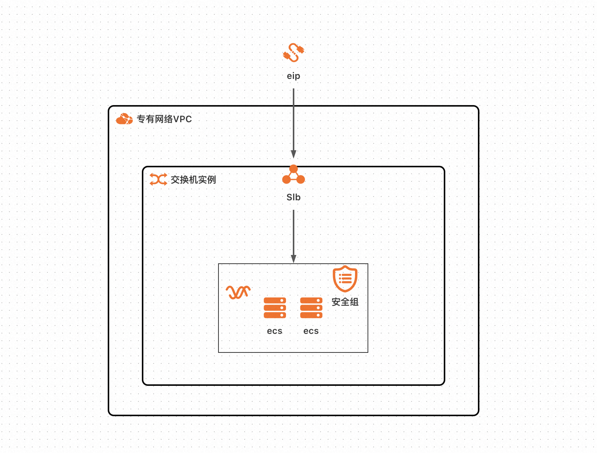
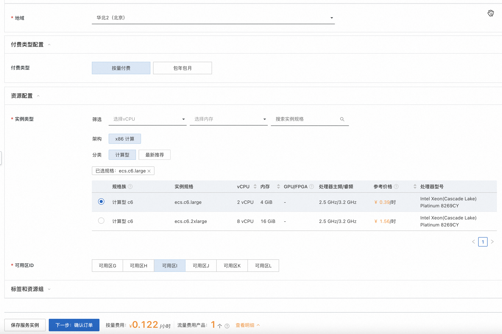
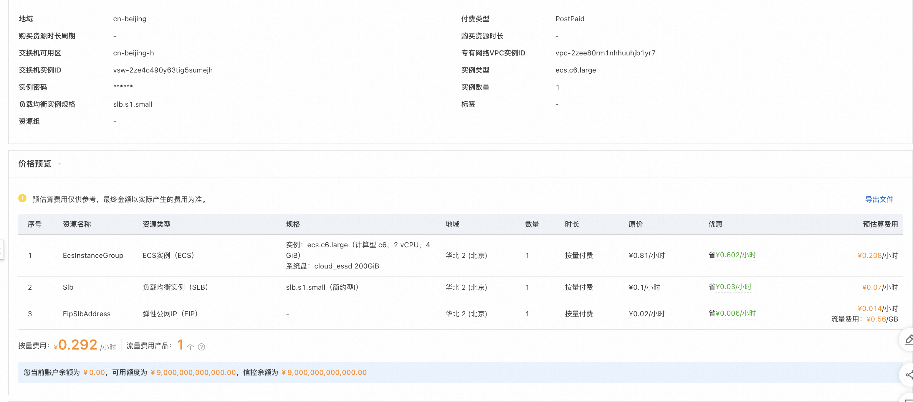
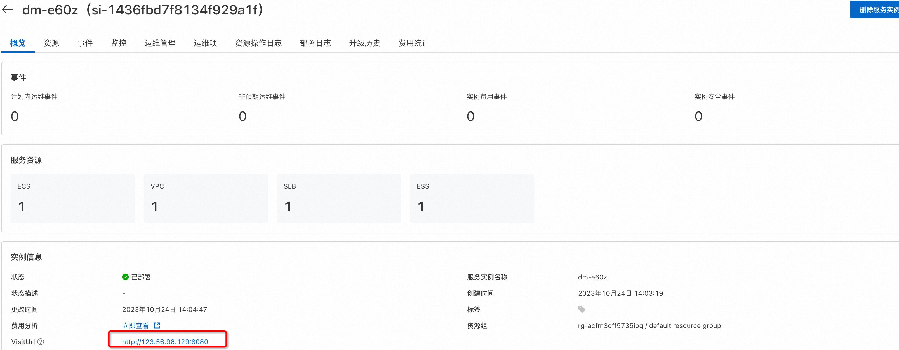
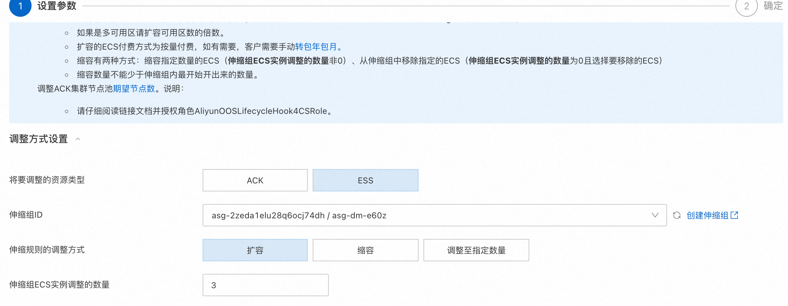
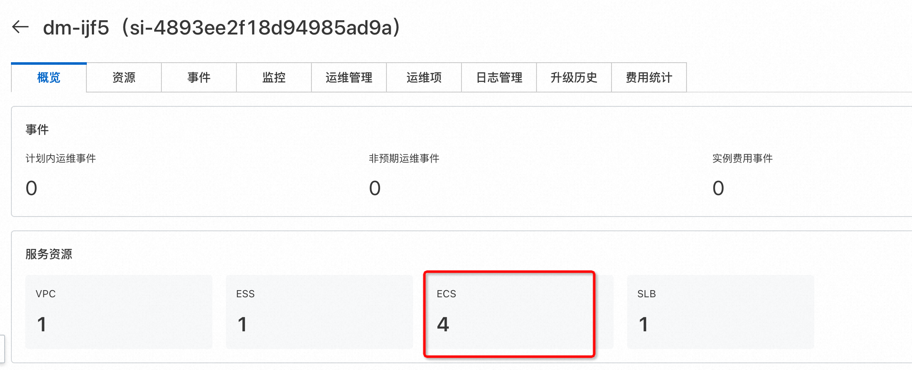

# 服务模版说明文档

## 服务说明

本文介绍基于springboot+软件包的ecs集群版服务快速上手流程，本示例对应的[git地址](https://github.com/aliyun-computenest/springboot-scaling-ecs-demo)

本示例会自动的构建计算巢服务，具体的服务构建流程为
1. 上传文件并构建计算巢文件部署物
2. 创建计算巢服务并关联文件部署物

创建过程大约持续1分钟，当服务变成待提交后构建成功

## 服务架构

本部署架构为集群ecs部署，通过eip 8080端口访问，配备负载均衡和弹性伸缩组，具体如图所示:


## 服务构建计费说明

测试本服务构建无需任何费用，创建服务实例涉及的费用参考服务实例计费说明

## RAM账号所需权限

本服务需要对ECS、VPC等资源进行访问和创建操作，若您使用RAM用户创建服务实例，需要在创建服务实例前，对使用的RAM用户的账号添加相应资源的权限。添加RAM权限的详细操作，请参见[为RAM用户授权](https://help.aliyun.com/document_detail/121945.html)。所需权限如下表所示。

| 权限策略名称                          | 备注                     |
|---------------------------------|------------------------|
| AliyunECSFullAccess             | 管理云服务器服务（ECS）的权限       |
| AliyunVPCFullAccess             | 管理专有网络（VPC）的权限         |
| AliyunESSFullAccess             | 管理弹性伸缩 (ESS) 的权限        |
| AliyunSLBFullAccess             | 管理负载均衡 (SLB) 的权限        |
| AliyunROSFullAccess             | 管理资源编排服务（ROS）的权限       |
| AliyunComputeNestUserFullAccess | 管理计算巢服务（ComputeNest）的用户侧权限 |
| AliyunComputeNestSupplierFullAccess | 管理计算巢服务（ComputeNest）的服务商侧权限 |


## 服务实例计费说明

测试本服务在计算巢上的费用主要涉及：

- 所选vCPU与内存规格
- 系统盘类型及容量
- 负载均衡配置
- EIP费用

计费方式包括：

- 按量付费（小时）
- 包年包月

目前提供如下实例类型：

| 规格族 | vCPU与内存 | 系统盘 | 公网带宽 |
| --- | --- | --- | --- |
| ecs.c6.large | 内存型c6，2vCPU 4GiB | ESSD云盘 200GiB PL0 | 固定带宽1Mbps |
| ecs.c6.2large | 内存型c6，4vCPU 8GiB | ESSD云盘 200GiB PL0 | 固定带宽1Mbps |

预估费用在创建实例时可实时看到。


## 服务实例部署流程


### 部署参数说明

| 参数组         | 参数项    | 说明                                                                     |
|-------------|--------|------------------------------------------------------------------------|
| 服务实例        | 服务实例名称 | 长度不超过64个字符，必须以英文字母开头，可包含数字、英文字母、短划线（-）和下划线（_） |
|             | 地域     | 服务实例部署的地域                                                              |
|             | 付费类型   | 资源的计费类型：按量付费和包年包月                                                      |
| ECS实例配置  | 实例类型   | ECS实例规格配置                                                          |
|              | 实例密码   | 长度8-30，必须包含三项（大写字母、小写字母、数字、 ()`~!@#$%^&*-+=&#124;{}[]:;'<>,.?/ 中的特殊符号） |
| SLB配置       ｜  实例规格 ｜ SLB实例规格配置
| 网络配置        | 可用区    | ECS实例所在可用区                                                             |

### 部署步骤

0. 部署链接
 
1. 单击部署链接，进入服务实例部署界面，根据界面提示，填写参数完成部署。
 
2. 参数填写完成后可以看到对应询价明细，确认参数后点击**下一步：确认订单**。
 
3. 确认订单完成后同意服务协议并点击**立即创建**
   进入部署阶段。
    
    
4. 等待部署完成后就可以开始使用服务，进入服务实例详情点击visitUrl。
    
5. 部署结果
    
6. 弹性扩缩容
    
    )
    
    
   等待结束执行后可以看到资源中新增了3台ecs，完成了扩缩容
    

## 服务详细说明

基础服务说明请参考springboot软件包部署单机版，本文在此基础上新增了slb和ess的配置

1. slb给ecs配置负载均衡并绑定对应的eip

```yaml
  Slb:
    Type: ALIYUN::SLB::LoadBalancer
    Properties:
      VpcId:
        Ref: VpcId
      VSwitchId:
        Ref: VSwitchId
      LoadBalancerName:
        Fn::Join:
          - '-'
          - - 'slb'
            - Ref: ALIYUN::StackName
      PayType:
        Ref: PayType
      PricingCycle:
        Ref: PayPeriodUnit
      Duration:
        Ref: PayPeriod
      AddressType: intranet
      LoadBalancerSpec:
        Ref: LoadBalancerSpec
      AutoPay: true
  EipSlbAddress:
    Type: ALIYUN::VPC::EIP
    Properties:
      Name:
        Ref: ALIYUN::StackName
      InternetChargeType: PayByTraffic
      Bandwidth: 5
  EipSlbAddressAssociation:
    Type: ALIYUN::VPC::EIPAssociation
    Properties:
      InstanceId:
        Ref: Slb
      AllocationId:
        Ref: EipSlbAddress
  SlbBackendServerAttachment:
    DependsOn:
      - EcsInstanceGroup
    Type: ALIYUN::SLB::BackendServerAttachment
    Properties:
      BackendServerList:
        Fn::GetAtt:
          - EcsInstanceGroup
          - InstanceIds
      LoadBalancerId:
        Ref: Slb
      BackendServerWeightList:
        - 100
        - 100
  SlbListener:
    DependsOn:
      - Slb
    Type: ALIYUN::SLB::Listener
    Properties:
      Persistence:
        CookieTimeout: 60
        StickySession: 'on'
        PersistenceTimeout: 180
        XForwardedFor: 'off'
        StickySessionType: insert
      ListenerPort: 8080
      Bandwidth: -1
      HealthCheck:
        HttpCode: http_2xx,http_3xx,http_4xx,http_5xx
        HealthCheckType: tcp
        UnhealthyThreshold: 3
        Timeout: 5
        HealthyThreshold: 3
        Port: 8080
        URI: /
        Interval: 2
      LoadBalancerId:
        Ref: Slb
      BackendServerPort: 8080
      Protocol: tcp
```
2. ess配置增加弹性伸缩能力可以随时扩缩容

```yaml
EssInstanceScalingGroupEnable:
    Type: 'ALIYUN::ESS::ScalingGroupEnable'
    Properties:
      ScalingRuleArisExecuteVersion: '1'
      ScalingConfigurationId:
        Ref: EcsInstanceScalingConfiguration
      InstanceIds:
        'Fn::GetAtt':
          - EcsInstanceGroup
          - InstanceIds
      ScalingGroupId:
        Ref: EssInstanceScalingGroup
    DependsOn:
      - EcsInstanceScalingConfiguration
      - EssInstanceScalingGroup
  EcsInstanceScalingConfiguration:
    Type: 'ALIYUN::ESS::ScalingConfiguration'
    Properties:
      # 网络配置
      SecurityGroupId:
        Ref: EcsSecurityGroup
      # 伸缩组
      ScalingGroupId:
        Ref: EssInstanceScalingGroup
      ScalingConfigurationName:
        Fn::Join:
          - '-'
          - - 'sc'
            - Ref: ALIYUN::StackName
      # 实例类型
      InstanceType:
        Ref: EcsInstanceType
      # 磁盘配置
      SystemDiskCategory: cloud_essd
      SystemDiskSize: 200
      ImageId: centos_7_8_x64_20G_alibase_20211130.vhd
      InstanceName:
        Fn::Join:
          - '-'
          - - Ref: ALIYUN::StackName
            - '[1,4]'
      UserData:
        Fn::Sub:
          - |
            #!/bin/bash
            yum install -y java
            mkdir -p /home/admin/application
            cd /home/admin/application
            wget '{{ computenest::file::springboot }}' -O package.tgz
            tar xvf package.tgz
            /bin/bash deploy.sh start
          - AccountId:
              Ref: ALIYUN::TenantId
```
## 其他

[实例代码源地址](https://atomgit.com/flow-example/spring-boot)

[软件包package.tgz构建流程参考](https://help.aliyun.com/document_detail/153848.html)
